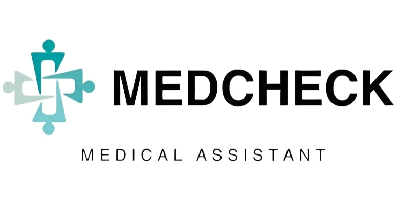
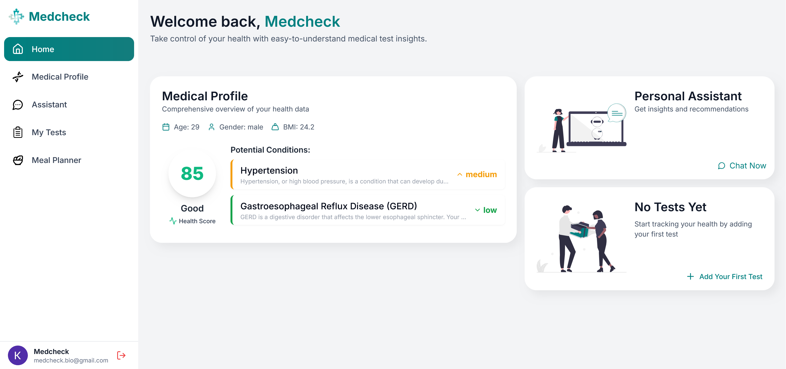

# Medcheck.bio- Your Intelligent Health Companion



Medcheck.bio is a cutting-edge Next.js-based web application designed to revolutionize personal health management. By leveraging artificial intelligence and user-friendly interfaces, Medcheck.bio provides personalized health insights, manages medical test results, and offers an AI-powered health assistant to address your health-related queries.

[Live Demo](https://medcheck-next.vercel.app/) | [Documentation](docs/README.md) | [Report Bug](https://github.com/dev-kristian/medcheck.bio/issues) | [Request Feature](https://github.com/dev-kristian/medcheck.bio/issues)



## 🌟 Features

- **Secure User Authentication**: Robust sign-up and sign-in processes with email verification
- **Personalized Onboarding**: Tailored welcome and introduction process for new users
- **Comprehensive Medical Profile**: Easy-to-use interface for managing personal health information
- **Test Results Management**: 
  - Upload and digitize medical test results
  - AI-powered analysis and interpretation of test results
  - Historical view of all past tests
- **Intelligent Health Assistant**: AI-driven chat interface for health-related queries and advice
- **Responsive Design**: Seamless experience across desktop, tablet, and mobile devices

## 🛠 Technologies

- **Frontend**: Next.js 13, React 18, Tailwind CSS
- **Authentication**: Firebase Authentication
- **State Management**: React Context API
- **AI Integration**: OpenAI API (for the health assistant)
- **Image Processing**: TensorFlow.js for client-side image analysis
- **Data Storage**: Firebase Firestore
- **Hosting**: Vercel

## 🚀 Getting Started

1. **Clone the repository:**
   ```
   git clone https://github.com/dev-kristian/medcheck.bio.git
   cd medcheck.bio
   ```

2. **Install dependencies:**
   ```
   npm install
   ```

3. **Environment Setup:**
   - Copy `.env.local.example` to `.env.local`
   - Fill in the required environment variables

4. **Run the development server:**
   ```
   npm run dev
   ```

5. Open [http://localhost:3000](http://localhost:3000) in your browser


## 🔑 Key Components

- `AuthLayout`: Handles the layout for authentication pages
- `Welcome`: Onboarding process for new users
- `Assistant`: AI-powered health chat interface
- `MedicalProfile`: User's medical information management
- `MyTestsPage`: Dashboard for user's medical tests
- `AddTestPage`: Interface for adding new test results
- `TestResultPage`: Detailed view of individual test results


## 📈 Performance

MedCheck AI is optimized for performance:

- Lighthouse Score: 94/100
- First Contentful Paint: 1.6s
- Time to Interactive: 1.2s

## 🔒 Security

- All data is encrypted at rest and in transit
- Regular security audits are conducted
- Compliant with HIPAA and GDPR regulations

## 🤝 Contributing

We welcome contributions to MedCheck.bio! Here's how you can help:

1. Fork the repository
2. Create your feature branch (`git checkout -b feature/AmazingFeature`)
3. Commit your changes (`git commit -m 'Add some AmazingFeature'`)
4. Push to the branch (`git push origin feature/AmazingFeature`)
5. Open a Pull Request

Please read [CONTRIBUTING.md](CONTRIBUTING.md) for details on our code of conduct and the process for submitting pull requests.

## 📄 License

This project is licensed under the MIT License - see the [LICENSE](LICENSE) file for details.

## 🙏 Acknowledgements

- [Next.js Documentation](https://nextjs.org/docs)
- [Tailwind CSS](https://tailwindcss.com/)
- [Firebase](https://firebase.google.com/)
- [OpenAI](https://openai.com/)
- [Vercel](https://vercel.com/)

## 📞 Support

If you have any questions or need support, please email our team at medcheck.bio@gmail.com or open an issue in this repository.

---

Made with ❤️ by Kristian Aleksi
